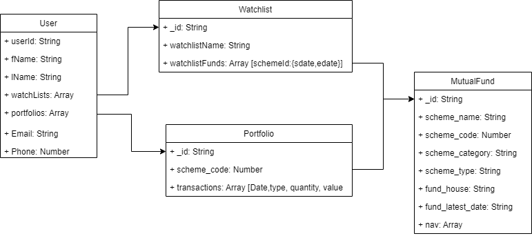

# MFCharts V2

Portfolio management tool

nothing did today, just don't want to get demotivated by loosing streak.

## Documentation

- Here is the documentation for User stories, data modelling, API's
  [Google Doc](https://docs.google.com/document/d/1v8wk0hIdS6WpyUDx7LQsPvHGOFgC3on_GuQvgGMuE3s/edit?usp=sharing)
  [V2 Google Doc](https://docs.google.com/document/d/1ITYOjA_5ysMa3fWEa2ednI_jYain99E7xaSf74KPCz4/edit)

## Model Diagram



## Installation

## Main branch restictions

- To push changes in main branch, follow below steps
  - Create a new branch from main and work on your changes
  - Push the new branch to github
  - Create a new pullrequest w.r.t main branch in github UI

## Project Structure

- root
  - js
    - phoenix
      - components
        - Alert
          - index.js
          - Alert.jsx
          - styles.css
        - ...
      - pages
        - login.jsx
        - signup.jsx
        - ...
      - constants
        - theme.js
      - ...
  - python
    - new service
      - ...

---

## Commit Structure

```bash
<language>(<project name>): <One liner commit message>

- <Description>
- <Description>

<Jira ticket number>
```

---

## Credits
